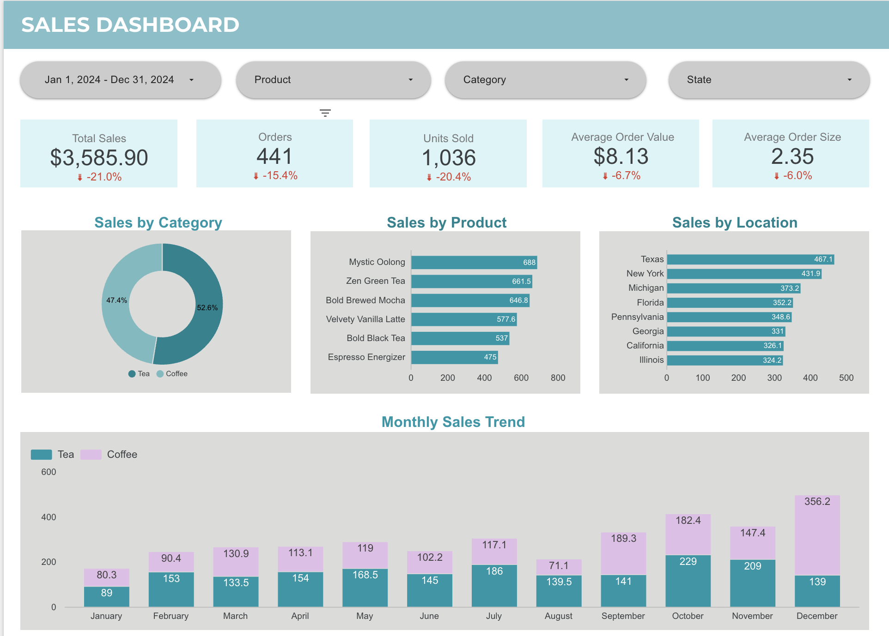

# ☕ Sales Dashboard (Looker)

## 📊 Overview
This project showcases an interactive **Sales Dashboard built in Looker**, designed to provide actionable insights into business performance.  
The dashboard highlights **total sales, orders, units sold, AOV (Average Order Value), order size, and category-level trends** for a café business selling **Tea and Coffee products**.

The goal of this dashboard is to enable data-driven decision-making by analyzing performance **across time, products, categories, and locations**.

---

## ⚙️ Tech Stack
- **Looker** – for building the interactive dashboard and data exploration  

---

## 📈 Key Insights

### 🔹 Overall KPIs
- **Total Sales:** $3,585.90 _(↓ 21%)_  
- **Orders:** 441 _(↓ 15.4%)_  
- **Units Sold:** 1,036 _(↓ 20.4%)_  
- **Average Order Value:** $8.13 _(↓ 6.7%)_  
- **Average Order Size:** 2.35 _(↓ 6%)_

---

### 🔹 Sales by Category
- **Tea:** 52.6% of sales  
- **Coffee:** 47.4% of sales  

---

### 🔹 Sales by Product
Top-performing products include:
1. Mystic Oolong – 688  
2. Zen Green Tea – 661.5  
3. Bold Brewed Mocha – 646.8  
4. Velvety Vanilla Latte – 577.6  
5. Bold Black Tea – 537  
6. Espresso Energizer – 475  

---

### 🔹 Sales by Location
Top states by sales:
- **Texas** – 467.1  
- **New York** – 431.9  
- **Michigan** – 373.2  
- **Florida** – 352.2  
- **Pennsylvania** – 348.6  
- **Georgia** – 331  
- **California** – 326.1  
- **Illinois** – 324.2  

---

### 🔹 Monthly Sales Trend
- Sales fluctuate across the year with peaks in **October ($411.4)** and **December ($495.2)**.  
- Coffee sales surge in **Q4**, while Tea remains stable throughout the year.  

---

## 🚀 How to Use
1. Clone this repository.  
2. Open the **Looker Dashboard** in your workspace.  
3. Explore filters by:
   - **Date range**
   - **Product**
   - **Category**
   - **State**  
4. Drill down into KPIs, product-level insights, and location-based sales.

---

## 💡 Future Improvements
- Add **forecasting using Looker ML integrations**.  
- Enable **customer segmentation analysis**.  
- Add **profitability metrics** alongside sales.  

